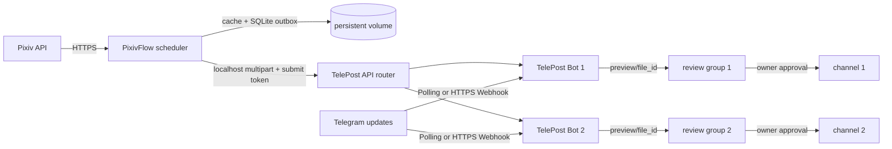

# 架构与信任边界

本仓库只负责组合、配置与运维，不复制 PixivFlow 或 TelePost 的业务实现。

## 进程模型

- 一个 TelePost supervisor 启动一个或多个独立 Bot 进程；每个 Bot 有独立数据库、Token、
  频道和审核群。
- 一个 PixivFlow Node 进程承载多条计划，共享 Pixiv 登录、下载缓存和 delivery outbox；
  低内存部署将下载并发限制为 1。
- Compose 可选启动 Caddy 或 Mihomo。Fly.io 使用平台 HTTPS，不需要 Caddy。

## 持久化与失败语义

`/app/data` 是唯一必须持久化的目录，包含 Bot SQLite、PixivFlow SQLite、下载缓存、元数据
与 outbox。PixivFlow 只有在 TelePost 返回成功后才完成投递；网络或 API 失败会保留 outbox
及其引用文件重试。最终无候选通知也是 outbox 项（不引用媒体）；TelePost
用各 Bot SQLite 中的幂等键跨重启去重。TelePost 把审核预览上传到 Telegram 后删除本地
API 临时文件，只保存 `file_id` 与审核状态，因此待审核积压不会长期保留原图。

任何清理工具都不得先删除仍被 outbox 引用的文件。升级或迁移前应先备份整个持久卷；
SQLite WAL 活跃时应使用卷快照，或连同 `-wal`/`-shm` 一起备份。

## 配置更新

- PixivFlow：新 JSON 先在同一文件系统写临时文件，再原子替换；scheduler 完整校验后热重载。
- TelePost：频道和审核策略来自环境变量，需要短暂重建 Bot 进程；持久卷不变。
- Secret：只通过 `.env` 或平台 Secret 注入，模板中只保留变量引用。

## 网络与信任边界

- PixivFlow 到 TelePost 默认走 `127.0.0.1`，投稿 Token 不应跨公网传输。
- 无公网机器使用 Polling；有公网时只有 TLS 反向代理或 Fly HTTPS 入口接收 Webhook。
- `/health` 不返回投稿标题、标签、用户或凭据；API 根端口默认绑定 loopback。
- 代理能观察出站目标与流量元数据，应视为受信基础设施，订阅 URL 也按 Secret 管理。
