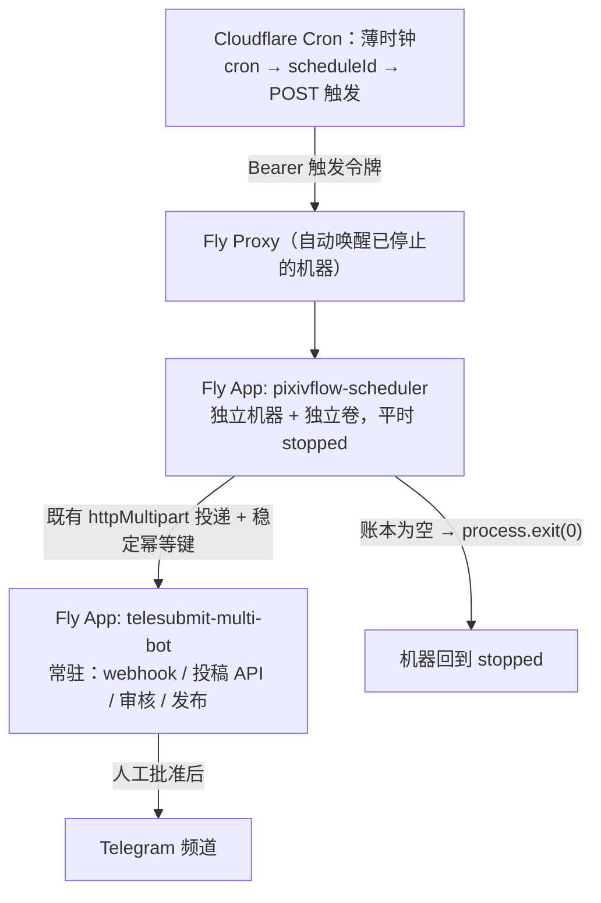

# 架构与信任边界

**本文件是三个仓库的职责契约的唯一权威描述。** 与本文冲突的 README、脚本注释或历史文档
以本文为准；本文与真实代码冲突时，以代码为准并修正本文。

## 三句话契约

1. **Cloudflare 只决定「何时唤醒」**：把 cron 表达式映射为 schedule 标识，发一个带触发令牌
   的 POST，然后结束。它不计算 occurrence、不换算时区、不生成槽位标识、不写任何业务表。
2. **PixivFlow 只决定「执行哪些 Pixiv 工作、如何可靠执行与投递」**：拥有调度域、槽位账本、
   执行租约、下载、投递队列与重试。它平时是停止的机器，被触发唤醒，账本空了就自己退出。
3. **TelePost 只决定「投稿如何审核与发布」**：它是唯一常驻、唯一持有 Telegram 令牌、
   唯一能发布到频道的服务。人工批准之前，任何作品都不会进入频道。

一条推论：**执行机器里没有任何 Telegram 凭据**。PixivFlow 对外的唯一出口是 TelePost 的投稿
接口，因此它既无法把投稿直发频道，也无法绕过审核，更无法把投稿机器人的 webhook 指到自己身上。

## 拓扑



| 平面 | 部署单元 | 自己拥有的状态 | 绝不拥有 |
| --- | --- | --- | --- |
| 触发 | `control-plane`（Worker `pixivflow-control-plane`） | cron → schedule 标识映射、一个触发令牌 | occurrence、槽位、凭据、审核、发布、Telegram |
| 执行 | `fly/deploy.pixivflow.toml`（app `pixivflow-scheduler`） | 槽位账本、执行租约、下载缓存、投递 outbox、Pixiv 凭据 | Telegram 令牌、频道、审核决定 |
| 业务 | `fly/deploy.telepost.toml`（app `telesubmit-multi-bot`） | 用户会话、投稿幂等键、审核队列、发布记录、Telegram 令牌 | Pixiv 登录、下载、槽位调度 |

`deploy.pixivflow.toml` 与 `deploy.telepost.toml` 是本仓库**唯一的两份拓扑来源**。
`control-plane/test/deployment-contract.test.ts` 会在出现第三份 Fly 配置、cron 与映射不一致、
或卷/停机参数被改动时失败——历史上正是「两份都像权威的配置」把混部拓扑带了回来。

## 生命周期：为什么是「自动唤醒 + 不自动停止 + 自己退出」

PixivFlow 平时停止，不跑任务时不占机器成本。唤醒与停机各自只有一个负责人：

- **唤醒**由触发请求完成。Fly proxy 对已停止的机器会先启动再转发
  （`auto_start_machines = true`），所以触发链路里不需要机器管理接口令牌，也不需要维护机器标识。
- **停机**由 PixivFlow 自己的账本决定（`schedulerRuntime.exitWhenIdle = true`）。
  空闲判定只读本进程的权威状态：非终态槽位、处理中的投递项、待投递项都为 0 才算空闲，
  再经过 `idleGraceMs`（10 分钟）宽限后 `exit(0)`；另有 `maxLifetimeMs`（3 小时）硬上限兜底。

**为什么不能用平台侧 auto-stop**：触发端在 occurrence 落库后立刻应答（下载实测 10–40 分钟，
不可能挂在 HTTP 连接上），所以在代理眼里这个连接早就空闲了，而下载还在跑。平台按空闲推断
停机，就会把批次拦腰砍断。同理，本应用**不配置任何健康检查**：探测本身就是请求，会把刚刚
决定收工的机器重新叫醒，形成一个永远停不下来的循环。

空闲宽限是合并窗口而不是超时：10:00 与 10:10 两个 schedule 由同一次唤醒服务，刚跑完的投递
重试也能在同一个窗口内排空，不必付第二次冷启动。

**TelePost 相反，它从不休眠。** 冷启动对用户是可见的（私聊投稿像是坏了），所以
`auto_stop_machines = false`、`min_machines_running = 1`，并保留长期健康检查。

## 持久化与失败语义

- `/app/data` 是唯一必须持久化的目录：PixivFlow 的 `pixivflow.db`、下载缓存、元数据与 outbox；
  TelePost 的每 Bot SQLite。两者在不同应用、不同卷上，互不共享文件系统。
- PixivFlow 只有在 TelePost 返回成功后才完成投递；网络或 API 失败会保留 outbox 及其引用的
  文件重试。跨重启去重靠各 Bot SQLite 中的幂等键：同一作品不会产生第二条审核请求。
- TelePost 把审核预览上传到 Telegram 后删除本地 API 临时文件，只保存 `file_id` 与审核状态，
  因此待审核积压不会长期保留原图。
- 任何清理工具都不得先删除仍被 outbox 引用的文件。升级或迁移前应先备份整个持久卷；
  SQLite WAL 活跃时应使用卷快照，或连同 `-wal`/`-shm` 一起备份。
- **不重放历史**：`catchUpMissedRuns = false`。迁移或长时间停机期间错过的时间点不会补跑——
  补跑等于把昨天的内容当成今天的推给用户。

**catch-up ≠ wake-up**：catch-up 是应用级容错（重启、崩溃、宿主机维护后补上漏跑的时间点），
本生产的策略是关闭它；wake-up 解决「让停止的基础设施重新启动」，那是部署平台的事。

## 配置与凭据归属

| 键 | 归属 | 说明 |
| --- | --- | --- |
| `PIXIVFLOW_TRIGGER_BASE_URL` | Worker `[vars]` | 触发地址，非机密 |
| `SCHEDULER_TRIGGER_TOKEN` | Worker secret + PixivFlow secret | 两端共享的触发令牌 |
| `PIXIV_CLIENT_ID/SECRET/DEVICE_TOKEN/REFRESH_TOKEN` | PixivFlow secrets | 只进执行机器 |
| `TELEPOST_BOT1/2_SUBMIT_TOKEN` | PixivFlow secrets | 投稿接口令牌，只进执行机器 |
| `BOT1/2_TOKEN`、`BOT1/2_CHANNEL_ID`、`BOT1/2_OWNER_ID` | TelePost secrets | 只进业务服务 |
| `TELEPOST_API_BASE_URL` | PixivFlow `[env]` | 指向 `http://telesubmit-multi-bot.flycast`（6PN 私网） |

`fly/deploy.pixivflow.toml` 与 `pixivflow/config/production.json` 中不得出现任何 Telegram 键——
`control-plane/test/webhook-ownership.test.ts` 会静态保证这一点。

配置更新的位置也随之确定：PixivFlow 的运行配置随镜像发布（`pixivflow/config/production.json`，
`watchConfig = false`，不存在「运行中被改一半」的窗口），凭据走平台 secret；TelePost 的部署默认值
来自环境变量，OWNER 的 `/botconfig` 覆盖原子保存在各 Bot 持久目录并只重载对应 Bot。

## 网络与信任边界

- PixivFlow 到 TelePost 走 Flycast 私网（`http://telesubmit-multi-bot.flycast`），因此
  `deploy.telepost.toml` 必须保持 `force_https = false`：Fly proxy 的 301 会把明文投递变成死路。
  6PN 流量本身在 WireGuard 上加密；Telegram webhook 与审核 API 仍走公网 HTTPS。
- Telegram webhook 只有一个负责人：TelePost 启动时注册。本仓库不得有任何代码或脚本注册它
  （`control-plane/test/webhook-ownership.test.ts` 静态守护，`scripts/verify-production.sh`
  用真实 API 只读核对）。
- `/health` 不返回投稿标题、标签、用户或凭据；API 根端口默认绑定 loopback。
- 代理能观察出站目标与流量元数据，应视为受信基础设施，订阅 URL 也按 Secret 管理。

## 自托管（docker-compose）与本文的关系

`docker-compose.yml` + `docker/combined.Dockerfile` 是**单机自托管**路径：所有角色在一个容器内，
生命周期由宿主决定。它是便利方案，**不是本文描述的生产拓扑**，也不具备「执行机器没有 Telegram
凭据」这条边界。自托管用户请以 compose 与其文档为准；生产请使用上面的两个 Fly 应用。

## 运维与验证

```bash
./scripts/verify-production.sh          # 只读：三平面状态、停机参数、触发鉴权、webhook 归属
./scripts/smoke-telepost.sh             # 只读：TelePost 探针与投稿接口鉴权
./scripts/smoke-pixivflow.sh            # 只读：PixivFlow 停机状态与未授权触发被拒
./scripts/verify-webhooks.sh            # 只读：两个 bot 的 webhook 归属（需 BOT*_TOKEN）
./scripts/verify-images.sh              # 只读：部署镜像/提交号与期望值一致
```

需要凭据的检查在缺少环境变量时输出 `SKIP`，不会失败也不会打印任何密钥。
